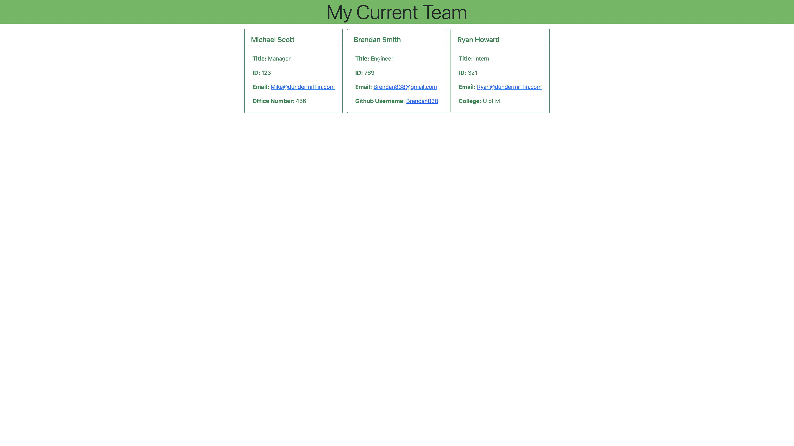

# Team Profile Generator

## Description 

Hello! This is project built using node.js, the inquirer library, fs library, and jest testing library. Once installed the user can follow prompts on the command line to create a web page displaying the data entered. [Here is a link to the demo.](https://drive.google.com/file/d/1fF9PeOhb2-D8NmjMasyOrl3C4JiM0D5f/view?usp=sharing)

## Table of Contents

-[Installation](#installation)

-[Usage](#usage)

-[Contributing](#contributing)

-[Tests](#tests)

-[Questions](#questions)

## Installation
To run necessary dependencies, run the following command:

npm i

## Usage

N/A

## Contributing

Not accepting contributions at this time. 

## Tests

To run tests, run the following command: **npm test**

## Questions

If you have any questions about the repo, or would like to open an issue, please contact me at Brendan838@gmail.com.

Click here to view more of my work on github: [Brendan838](https://github.com/Brendan838). Thank you!